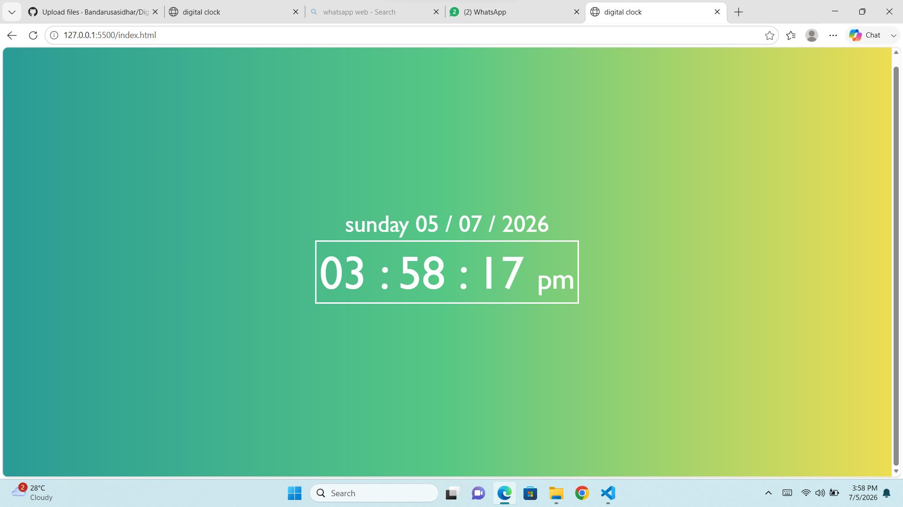

# ⏰ Digital Clock

A responsive Digital Clock built using *HTML, **CSS, and **JavaScript*. The application displays the current time, AM/PM format, current day, and current date in real time.

## 📸 Screenshot

## ✨ Features

- Real-time digital clock
- 12-hour time format (AM/PM)
- Live seconds update
- Current day display
- Current date display
- Responsive and clean user interface
- Gradient background with modern styling

## 🛠️ Technologies Used

- HTML5
- CSS3 (Flexbox)
- JavaScript (ES6)
- DOM Manipulation
- Date Object
- Functions
- Conditional Statements
- setInterval()

## 📂 Project Structure

Digital-clock/
│── index.html
│── style.css
│── script.js
│── screenshot.png
└── README.md

## 🚀 How to Run

1. Clone the repository

bash
git clone https://github.com/Bandarusasidhar/Digital-clock.git

2. Open the project folder.

3. Open index.html in any web browser.

## 🎯 Learning Outcomes

This project helped me practice:

- Structuring web pages using HTML
- Styling layouts with CSS Flexbox
- Working with JavaScript Date object
- DOM Manipulation
- Functions and Conditional Statements
- Real-time updates using setInterval()
- Git and GitHub version control

## 👨‍💻 Author

*Bandaru Sasidhar*

GitHub: https://github.com/Bandarusasidhar
